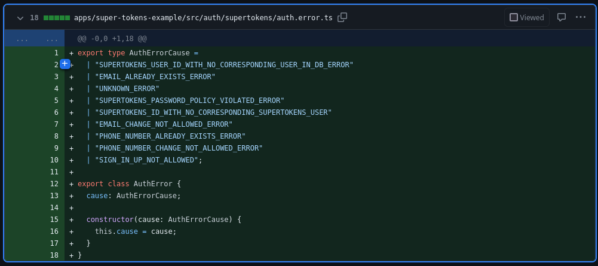

# Introduction

SuperTokens is an open source Auth0 alternative designed to simplify user authentication and session
management for web and mobile applications. It addresses common challenges developers face when implementing
security and provides a robust foundation for building secure authentication systems.
Some of its features include a comprehensive session management system, JWT support and easy integration.
Its capabilities take out the sweat involved in creating secure services.

# How To Install and Configure SuperTokens in Your Amplication Project

Begin by creating a service on the Amplication platform.

For the next step, install the SuperTokens plugin. You can do this by clicking on the 'Plugins' section within the 
service sidebar menu and selecting the SuperTokens plugin from the list of available plugins.


Under the list of installed plugins, make sure that the NestJS Auth Module plugin is installed and all other
auth provider plugins are not active. If the NestJS Auth Module plugin isn't installed, install it. If
any other auth provider plugins are active, disable them.

For example, in the image below:


The SuperTokens plugin is installed, the JWT auth provider is disabled, and the NestJS Auth Module plugin is
installed.

If you haven't done so, you should also create an authentication entity. Check
<a href="https://docs.amplication.com/how-to/add-delete-user-entity/">here</a> for info on this.

Now, you have to configure the SuperTokens plugin. You can do this by selecting the settings button next to the
the installed plugins list. You can then follow the guide in the 
<a href="https://github.com/amplication/plugins/tree/master/plugins/auth-supertokens#configuration">plugin's  README</a>.

After the configuration, you also have to ensure that the field `supertokensIdFieldName` exists on the
authentication entity.

After installation, click 'Commit changes and build' again. A new PR with an initial setup of SuperTokens 
configuration and some utility functions will be generated.

# What The Plugin Does

What code exactly is generated depends on the selected auth recipe, but they're all similar.

In <a href="https://github.com/d-sonuga/amplication-supertokens-example/">this sample repo</a>, the 
emailpassword recipe is selected as the auth recipe and supertokensId
is used as the `supertokensIdFieldName`. From this <a href="https://github.com/d-sonuga/amplication-supertokens-example/pull/1/commits/b520b259d96e7911ed98a9fdf6e44ce7cebbfbbc">commit</a>, 
the SuperTokens plugin does the following:

## For The Server Code

* Adds environment variables based on the configured settings


* Removes unneeded JWT auth specific settings from the `docker-compose.yml` file


* Adds the required dependencies to make use of SuperTokens


* The `prisma.schema`, too, is changed to reflect the new `supertokensId` field in the authentication entity


* Removes the automatic hashing of the initial user's password


* Disables the graphql playground and configures CORS to allow graphql requests to come from the website domain


* Removes a bunch of unneeded files: 
    + In `src/auth`: `Credentials.ts`, `IAuthStrategy.ts`, `ITokenService.ts`, `LoginArgs.ts`,
    `auth.controller.ts`, `auth.resolver.ts`, `auth.service.spec.ts`, `constants.ts`, `password.service.ts`,
    `password.service.spec.ts`, `token.service.ts`
    + The entire `src/auth/jwt`
    + In `src`: `constants.ts`
    + The entire `src/tests/auth`

* Unneeded password service is removed from the auth entity's service and service base


* Adds a session decorator that can be used to access a session in the parameter of a controller or resolver


* Adds middleware that provides the SuperTokens routes


* Applies middleware for SuperTokens routes


* Adds an auth filter for SuperTokens exceptions


* Adds code to configure the app to use the added auth filter, removes the default CORS setting and sets the 
required CORS settings


* Adds a configuration type used in the initialization of the SuperTokens SDK


* Adds a function used to get the SuperTokens configuration based on the set environment variables


* Adds a new auth guard that uses SuperTokens for authentication and the roles saved in the DB for
authorization and extends the default auth guard to make use of the generated one


* Adds an error type that can be used to handle errors resulting from SuperTokens function calls



* Generates a service with the SuperTokens initialization code and some utility functions


* Extends the auth service with the generated SuperTokens service and initializes it with the `super` call


* The authentication entity's controller, controller base, resolver base, and resolver are modified to include the 
roles builder and auth service in its constructor


* In the authentication entity, the new `supertokensId` field also leads to many changes in the DTOs.

## For The Admin UI

* Adds the environment variables based on the configured settings


* Adds the required dependencies to use the SuperTokens frontend SDK


* Adds a config file that provides functions to get the SuperTokens configuration depending on the set
environment variables


* Removes unneeded files `src/auth.ts`, `src/constants.ts`, `src/auth-provider/ra-auth-http.ts` and
`src/auth-provider/ra-auth-jwt.ts`

* Alters graphql data provider authorization code to remove the unneeded token handling, as SuperTokens already
handles this


* Alters the `Credentials` type to reflect the email-password authentication method


* Adds the SuperTokens auth provider which makes use of the SuperTokens frontend SDK to implement its auth 
functions


* Configures the app to use the SuperTokens auth provider


* Alters the login component to reflect the email-password method being used and removes the graphql connect
option


* Because of the added `supertokensId` field, the API components representing the authentication entity
is also modified

# What You Have To Do

After the generation of the code, there are still some things that need to be done because of the way
the code is setup. For info on how the authentication/authorization works in the generation code and what exactly 
needs to be done next, check this <a href="https://github.com/amplication/plugins/tree/master/plugins/auth-supertokens#usage">section</a> of the SuperTokens plugin's README.

# Customization

To demonstrate usage of the utility functions in the SuperTokens service, we can customize sample application 
in <a href="https://github.com/d-sonuga/amplication-supertokens-example">this repo</a>.

To create a new user on the SuperTokens core, we can use the `createSupertokensUser` function in the
server's `src/auth/supertokens/supertokens.service.ts`. This function can be called in the POST endpoint
for the authentication entity so as to create a corresponding user on the SuperTokens core and save that
user's supertokens ID in the DB on creation.

Initially, in the authentication entity's controller base, the POST endpoint will look like this:

```js
@swagger.ApiBearerAuth()
@common.UseGuards(defaultAuthGuard.DefaultAuthGuard, nestAccessControl.ACGuard)
export class UserControllerBase {
    constructor(
        protected readonly service: UserService,
        protected readonly rolesBuilder: nestAccessControl.RolesBuilder,
        protected readonly authService: AuthService
    ) {}

    @common.UseInterceptors(AclValidateRequestInterceptor)
    @common.Post()
    @swagger.ApiCreatedResponse({ type: User })
    @nestAccessControl.UseRoles({
        resource: "User",
        action: "create",
        possession: "any",
    })
    @swagger.ApiForbiddenResponse({
        type: errors.ForbiddenException,
    })
    async create(@common.Body() data: UserCreateInput): Promise<User> {
        return await this.service.create({
            data: data,
            select: {
            createdAt: true,
            firstName: true,
            id: true,
            lastName: true,
            roles: true,
            supertokensId: true,
            updatedAt: true,
            username: true,
            },
        });
    }
    // ...Others
}
```

This can be modified to become:

```js
@swagger.ApiBearerAuth()
@common.UseGuards(defaultAuthGuard.DefaultAuthGuard, nestAccessControl.ACGuard)
export class UserControllerBase {
    constructor(
        protected readonly service: UserService,
        protected readonly rolesBuilder: nestAccessControl.RolesBuilder,
        protected readonly authService: AuthService
    ) {}

    @common.Post()
    @swagger.ApiCreatedResponse({ type: User })
    @Public()
    @swagger.ApiForbiddenResponse({
        type: errors.ForbiddenException,
    })
    async create(@common.Body() data: UserCreateInput & {email?: string}): Promise<User> {
        try {
            if(!data.email) {
                throw new common.BadRequestException("The email must be provided");
            }
            // Creating the user on the SuperTokens core
            const supertokensId = await this.authService.createSupertokensUser(data.email, data.password);
            delete data.email;
            return await this.service.create({
                data: {
                    ...data,
                    // Saving the SuperTokens ID of the newly created user in the DB
                    supertokensId
                },
                select: {
                createdAt: true,
                firstName: true,
                id: true,
                lastName: true,
                roles: true,
                supertokensId: true,
                updatedAt: true,
                username: true,
                },
            });
        } catch(e: any) {
            if(e.cause) {
                const err = e as AuthError;
                if(err.cause === "EMAIL_ALREADY_EXISTS_ERROR") {
                    throw new common.BadRequestException("The email already exists");
                }
            }
            throw e;
        }
    }

    // ...Others
}
```

For the purpose of demonstration, the endpoint is also made public with the `Public` decorator.
These imports should also be added:

```js
import { Public } from "../../decorators/public.decorator";
import { AuthError } from "../../auth/supertokens/auth.error";
```

After starting the server, make a POST request:

```
curl -X POST http://localhost:3000/api/users \
    -H "Content-Type: application/json" \
    -d '{
    "email": "sonugademilade8703@gmail.com",
    "password": "password1",
    "roles": ["user"],
    "username": "demilade"
  }'
```

To verify that the user has been created on the SuperTokens core, you can open the SuperTokens dashboard
which is at `http://<server-domain>/<api-base-path>/dashboard/`.


Click the Add a new user link and create a new user to log into the dashboard.

On the dashboard is the user newly created through the POST endpoint:


# Conclusion

The SuperTokens plugin provides an effortless way to implement authentication in your Amplication app.
This post only briefs through the essentials of the plugin, as it also has support for integrating
multiple auth recipes with your application and the admin UI.

